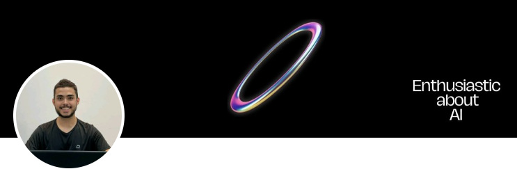
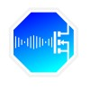

<html><head><meta http-equiv="Content-Type" content="text/html; charset=utf-8"/><title>Fabio Romero de Souza Junior </title></head><body><article id="12668f86-1da4-80de-9450-c7152f50650e" class="page sans"><header><h1 class="page-title">Fabio Romero de Souza Junior </h1>

</header>

Engenheiro da Computação pela UFU e Técnico em Eletrônica pelo CEFET-MG, com sólida formação em desenvolvimento e tecnologia. Atualmente, curso Mestrado em Engenharia Elétrica com foco em Processamento Digital de Sinais e Redes de Comunicação e um MBA em Data Science e Analytics pela USP/Esalq. 

Apaixonado por Inteligência Artificial, busco aplicar IA em ambientes de produção para desenvolver soluções inovadoras e eficientes.

<h3 id="12668f86-1da4-8089-b99f-ec358635caa4" class=""><strong>Experiência Profissional: </strong></h3>

<figure id="12668f86-1da4-80f3-9617-cadcd8ad7f70" class="image"></figure>

<strong>Laboratório de Redes Inteligentes (LRI-UFU) </strong><em>Pesquisador/Programador </em>

(P&amp;D ANEEL nº 00393-0015/2022)

<strong>Período:</strong> Fevereiro 2023 - Fevereiro 2024

<ul id="12668f86-1da4-804b-a6c7-d4a02d5029a6" class="bulleted-list"><li style="list-style-type:disc">Realização de rotinas de pesquisa aplicada em sistemas de energia elétrica.</li></ul><ul id="12668f86-1da4-80b6-ac60-c40f9f3da668" class="bulleted-list"><li style="list-style-type:disc">Desenvolvimento e manutenção de aplicações utilizando Python, C# e GIS</li></ul><ul id="12668f86-1da4-805b-93d0-fe1efb8fca08" class="bulleted-list"><li style="list-style-type:disc">Integração de sistemas com APIs e bibliotecas de geoprocessamento.</li></ul><ul id="12668f86-1da4-806a-8fd7-e9b821403f1f" class="bulleted-list"><li style="list-style-type:disc">Documentação técnica e colaboração em equipe multidisciplinar para desenvolvimento de soluções inovadoras.</li></ul>

<figure id="12668f86-1da4-80d8-b2ce-ee1aab3bf7ce" class="image"></figure>

<strong>UOL Compass </strong>

<em>Estagiário</em>

<em>Cognitive Computing AWS </em>

<strong>Período:</strong> Março 2023 - Setembro 2023

<strong>Atividades:</strong>
<ul id="12668f86-1da4-808f-8276-c34c0baead2d" class="bulleted-list"><li style="list-style-type:disc">Aprofundamento em AWS e machine learning.</li></ul><ul id="12668f86-1da4-80b0-bb01-f1c57c1af02d" class="bulleted-list"><li style="list-style-type:disc">Exploração de conceitos de computação em nuvem e serviços como Amazon Comprehend, Amazon Kendra, e Amazon Lex para processamento de linguagem natural e interações conversacionais.</li></ul><ul id="12668f86-1da4-80b1-a3d7-ce4b7edc5cfb" class="bulleted-list"><li style="list-style-type:disc">Utilização de Amazon Rekognition para análise de imagens.</li></ul><ul id="12668f86-1da4-807f-9470-e7fca043d438" class="bulleted-list"><li style="list-style-type:disc">Desenvolvimento de habilidades com Amazon Polly e Alexa Skill Kit para tecnologias de voz.</li></ul><ul id="12668f86-1da4-8026-b8ec-c03bd293061f" class="bulleted-list"><li style="list-style-type:disc">Experiência prática com Amazon SageMaker para desenvolvimento de modelos de machine learning.</li></ul><ul id="12668f86-1da4-809d-b68d-e7513332b403" class="bulleted-list"><li style="list-style-type:disc">Participação em um ambiente ágil, compreendendo a importância da colaboração e adaptação contínua.</li></ul>

<figure id="12668f86-1da4-8084-adcf-f233c4c820c8" class="image"></figure>

<strong>Laboratório de Redes Inteligentes (LRI-UFU)</strong>

<em>Programador C# .NET </em>

(P&amp;D Petrobras ANEEL nº PD-00553-0071/2021)

<strong>Período:</strong> Fevereiro 2023 - Fevereiro 2024

<strong>Atividades:</strong>
<ul id="12668f86-1da4-80f0-a59b-c60e45764450" class="bulleted-list"><li style="list-style-type:disc">Desenvolvimento e manutenção de aplicações utilizando C#, Git, PostgreSQL, MongoDB, Docker, e Jenkins.</li></ul><ul id="12668f86-1da4-80de-a2a8-e24628b82c7d" class="bulleted-list"><li style="list-style-type:disc">Utilização de Git para controle de versionamento de código.</li></ul><ul id="12668f86-1da4-8032-ad0e-d7138f195b36" class="bulleted-list"><li style="list-style-type:disc">Desenvolvimento de aplicações em C#.</li></ul><ul id="12668f86-1da4-808a-93ec-d6becd38ecb7" class="bulleted-list"><li style="list-style-type:disc">Utilização de Docker para implantação e execução de aplicações.</li></ul><ul id="12668f86-1da4-8009-adbf-c423293d6319" class="bulleted-list"><li style="list-style-type:disc">Integração contínua utilizando Jenkins para garantir a qualidade do código e a entrega contínua das aplicações.</li></ul><ul id="12668f86-1da4-80dc-b9c4-d1dd7d978574" class="bulleted-list"><li style="list-style-type:disc">Desenvolvimento de novas funcionalidades, correção de bugs, e otimização de desempenho das aplicações.</li></ul>

<h3 id="12668f86-1da4-80f0-85ce-eb815a8b4c3e" class=""><strong>Formação Acadêmica:</strong></h3>
<strong> </strong>

<strong>MBA em Data Science e Analytics</strong>

<em>USP/Esalq</em>

<strong>Período:</strong> 2024 - 2025

<strong>Mestrado em Engenharia Elétrica: Processamento Digital de Sinais e Redes de Comunicação</strong>

<em>Universidade Federal de Uberlândia (UFU)</em>

<strong>Período:</strong> 2024 - 2025

<strong>Graduação em Engenharia de Computação</strong>

<em>Universidade Federal de Uberlândia (UFU)</em>

<strong>Período:</strong> 2020 - 2023

<strong>Curso Técnico em Eletrônica</strong>

<em>Centro Federal de Educação Tecnológica de Minas Gerais</em>

<strong>Período:</strong> 2014 - 2015

<h3 id="12668f86-1da4-801e-97ea-f1273fe1fa56" class=""><strong>Idiomas</strong></h3><ul id="12668f86-1da4-80a2-a2ca-c93ff6e606bc" class="bulleted-list"><li style="list-style-type:disc"><strong>Português:</strong> Nativo/Fluente</li></ul><ul id="12668f86-1da4-8034-8dd5-d55a86bb6a10" class="bulleted-list"><li style="list-style-type:disc"><strong>Inglês:</strong> Básico</li></ul>
<h3 id="12668f86-1da4-80cc-a402-fa86af5551ef" class=""><strong>Projetos e Iniciação Científica</strong></h3>
<strong>Iniciação Científica: Controle de Tráfego em Smart Cities</strong>

<strong>Descrição:</strong> Desenvolvimento de um protótipo para controle de tráfego em Smart Cities, utilizando plataforma de prototipagem eletrônica Arduino, linguagem de programação Python e a biblioteca de visão computacional OpenCV.

<strong>Ano:</strong> 2018

<h3 id="12668f86-1da4-804c-b787-f2920a78ff86" class=""><strong>Certificados e Cursos</strong></h3><ul id="12668f86-1da4-8083-bfce-c95bb177b1ac" class="bulleted-list"><li style="list-style-type:disc"><strong>Cognizant Cloud Data Engineer</strong></li></ul><ul id="12668f86-1da4-80e2-ba26-ce04e7006a4b" class="bulleted-list"><li style="list-style-type:disc"><strong>Banco Carrefour Data Engineer</strong></li></ul>

<a href="https://www.linkedin.com/in/fabioromerosjunior/">https://www.linkedin.com/in/fabioromerosjunior/</a> 

http://lattes.cnpq.br/3976533093866468

https://github.com/FabioRSJunior

https://www.kaggle.com/fabiorsjunior

</article></body></html>